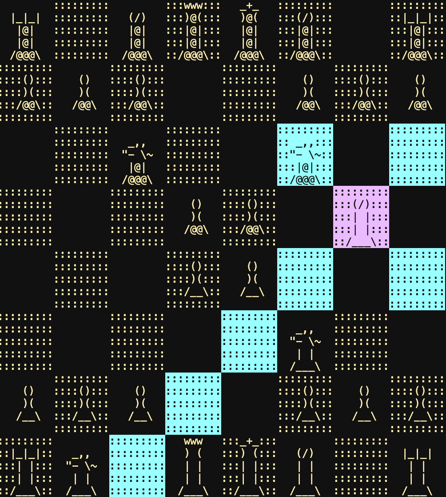

<!-- PROJECT LOGO -->
<br />
<p align="center">
  <a href="https://github.com/nicklamyeeman/my_chess">
    
  </a>

  <h3 align="center">CHESS</h3>

  <p align="center">
    Play the famous game int your Terminal
    <br />
    <a href="https://github.com/nicklamyeeman/my_chess"><strong>Explore the docs »</strong></a>
    <br />
    <br />
    <a href="https://github.com/nicklamyeeman/my_chess/issues">Report Bug</a>
    ·
    <a href="https://github.com/nicklamyeeman/my_chess/issues">Request Feature</a>
  </p>
</p>


<!-- TABLE OF CONTENTS -->
## Table of Contents

* [About the Project](#about-the-project)
  * [Built With](#built-with)
* [Getting Started](#getting-started)
  * [Prerequisites](#prerequisites)
  * [Installation](#installation)
* [Usage](#usage)
* [Roadmap](#roadmap)
* [Contributing](#contributing)
* [Contact](#contact)
* [Acknowledgements](#acknowledgements)


<!-- ABOUT THE PROJECT -->
## About The Project

This project is a personnal project. The goal is to recreate the famous chess game.
The game is still under developpement. The project purpose was to handle the mouse event in ncurses and later on be able to create an online ncurses game.
The ultimate goal will be to create my own AI playing chess. But nowadays, I don't have that much time for this little side project


### Built With

* [ncurses](https://invisible-island.net/ncurses/announce.html)


<!-- GETTING STARTED -->
## Getting Started

To get a local copy up and running follow these simple steps.

### Prerequisites

Be sure you have Ncurses installed on your PC, then open a terminal

### Installation

1. Clone the repo
```sh
git clone https://github.com/nicklamyeeman/my_chess.git
```
2. Compile it
```sh
make
```


<!-- USAGE -->
## Usage

### Example

```sh
./my_chess
```

Menu page:
<br/>


You can navigate throught the menu with your mouse !

The ascii menu is available at ```ressources/menu.txt```


The game is playable like a board that you have at home. No check, no game over. Just restart the program to restart the game.

### CUSTOMIZATION

Everything in the ```ressources/pieces``` and the ```ressources/board.txt``` can be changed for anything you want.
However, you might keep the same size of the your tiles if you want a coherent board and game.



<!-- ROADMAP -->
## Roadmap

See the [open issues](https://github.com/nicklamyeeman/my_chess/issues) for a list of proposed features (and known issues).


<!-- CONTRIBUTING -->
## Contributing

Contributions are what make the open source community such an amazing place to be learn, inspire, and create. Any contributions you make are **greatly appreciated**.

1. Fork the Project
2. Create your Feature Branch (`git checkout -b feature/AmazingFeature`)
3. Commit your Changes (`git commit -m 'Add some AmazingFeature'`)
4. Push to the Branch (`git push origin feature/AmazingFeature`)
5. Open a Pull Request


<!-- CONTACT -->
## Contact

Nick LAM YEE MAN - [@nickauteen](https://twitter.com/nickauteen) - nick.lam-yee-man@epitech.eu

Project Link: [https://github.com/nicklamyeeman/my_sokoban](https://github.com/nicklamyeeman/my_sokoban)


<!-- ACKNOWLEDGEMENTS -->
## Acknowledgements

* [Best-README Template](https://github.com/othneildrew/Best-README-Template)


<!-- MARKDOWN LINKS & IMAGES -->
<!-- https://www.markdownguide.org/basic-syntax/#reference-style-links -->
[contributors-shield]: https://img.shields.io/github/contributors/nicklamyeeman/repo.svg?style=flat-square
[contributors-url]: https://github.com/nicklamyeeman/repo/graphs/contributors
[forks-shield]: https://img.shields.io/github/forks/nicklamyeeman/repo.svg?style=flat-square
[forks-url]: https://github.com/nicklamyeeman/repo/network/members
[stars-shield]: https://img.shields.io/github/stars/nicklamyeeman/repo.svg?style=flat-square
[stars-url]: https://github.com/nicklamyeeman/repo/stargazers
[issues-shield]: https://img.shields.io/github/issues/nicklamyeeman/repo.svg?style=flat-square
[issues-url]: https://github.com/nicklamyeeman/repo/issues
[license-shield]: https://img.shields.io/github/license/nicklamyeeman/repo.svg?style=flat-square
[license-url]: https://github.com/nicklamyeeman/repo/blob/master/LICENSE.txt
[linkedin-shield]: https://img.shields.io/badge/-LinkedIn-black.svg?style=flat-square&logo=linkedin&colorB=555
[linkedin-url]: https://linkedin.com/in/nicklamyeeman
[product-screenshot]: images/screenshot.png